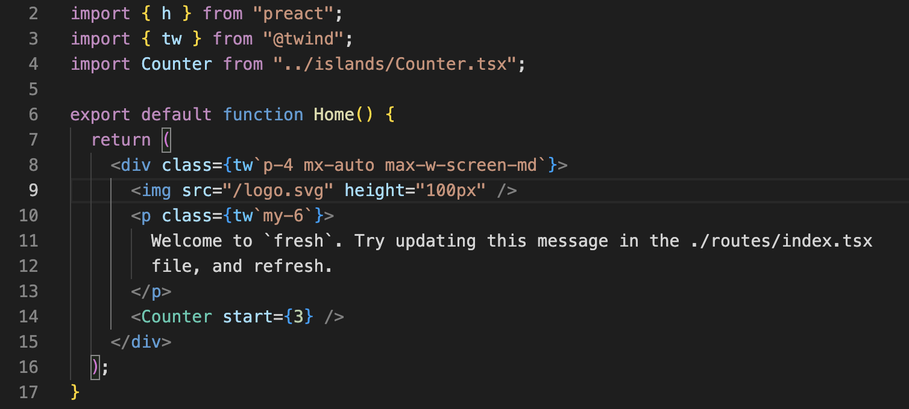
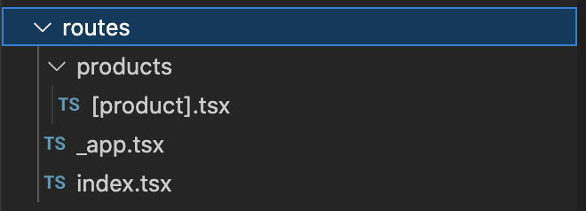
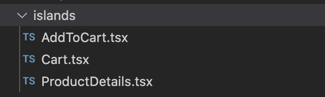
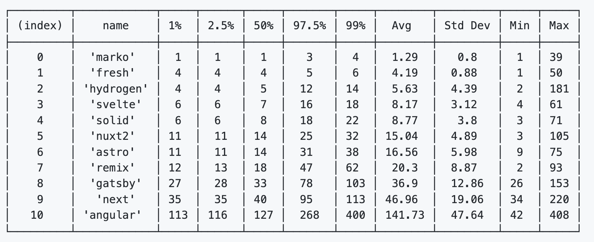
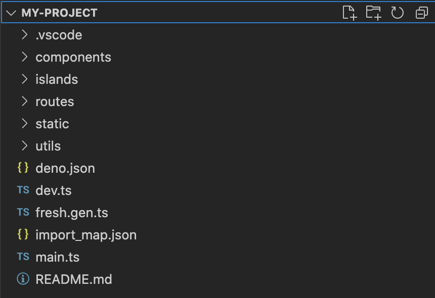

class: middle, center


Fresh の話

---
# 話す人


日野澤歓也 twitter @kt3k

- 2009 ~ Web 開発者
  - 言語 JS, PHP, Java, etc
- 2021 ~ Deno 開発者

<small>Deno 社では主に標準モジュール開発、Node 互換性開発を担当</small>

---
#  Fresh とは

- フロントエンド Web フレームワーク
- Deno 公式
- Preact ベース (React と互換な軽量ライブラリ)



---
#  Fresh の特徴

- ファイルベースルーティング (例. Next.js, Remix)
- => `routes/` 以下のファイルツリーがそのまま URL のパスになる



---
#  Fresh の特徴

- [Islands アーキテクチャ](https://jasonformat.com/islands-architecture/) (例. Astro)
- 画面内でインタラクションが必要な特定箇所 (island) だけ JS で hydration する。

<p style="text-align: center">
  
</p>

---
#  Fresh の特徴

- [Island アーキテクチャ](https://jasonformat.com/islands-architecture/) (例. Astro)
- 画面内に island がなければ JS が全くロードされない
  - 例. [Fresh のドキュメントサイト](https://fresh.deno.dev/docs/introduction)

---
#  Fresh の特徴

- `islands/` 以下にコンポーネントを書くとそれが island になる。



---
#  Fresh の特徴
- `routes/` 内に直接書いているコンポーネントはインタラクションの記述が不可
- onClick や useState が無効


---
#  Fresh の特徴

- 出力形式
  - SSR のみサポート
  - SSG 出力はない
  - SPA 遷移はなし

---
#  Fresh の特徴

- Fresh の SSR は速い
  - ソース: Framework Benchmarks [SSR Time](https://github.com/BuilderIO/framework-benchmarks#ssr-times)



---
#  Fresh の始め方

```
deno run -A -r https://fresh.deno.dev my-project
cd my-project
deno task start
```

<p style="text-align: center">
  
</p>

---
#  Fresh のデプロイ

- main.ts を指定して [Deno Deploy](https://deno.com/deploy) にデプロイする(楽、推奨)
- main.ts をエントリポイントとして Deno プログラムとしてデプロイする

---
# Fresh の使用例

- [Deno Merch](https://merch.deno.com/) (EC サイト)
- [deno.land ホームページ](https://deno.land/)
- [Deno Registry](https://deno.land/x)
- [Fresh のホームページ](https://fresh.deno.dev/)
- [Deno Chat](https://showcase-chat.deno.dev/) (Chat デモアプリ)

(全てオープンソース)

---
class: middle, center

ご清聴ありがとうございました 🙇‍♂️
